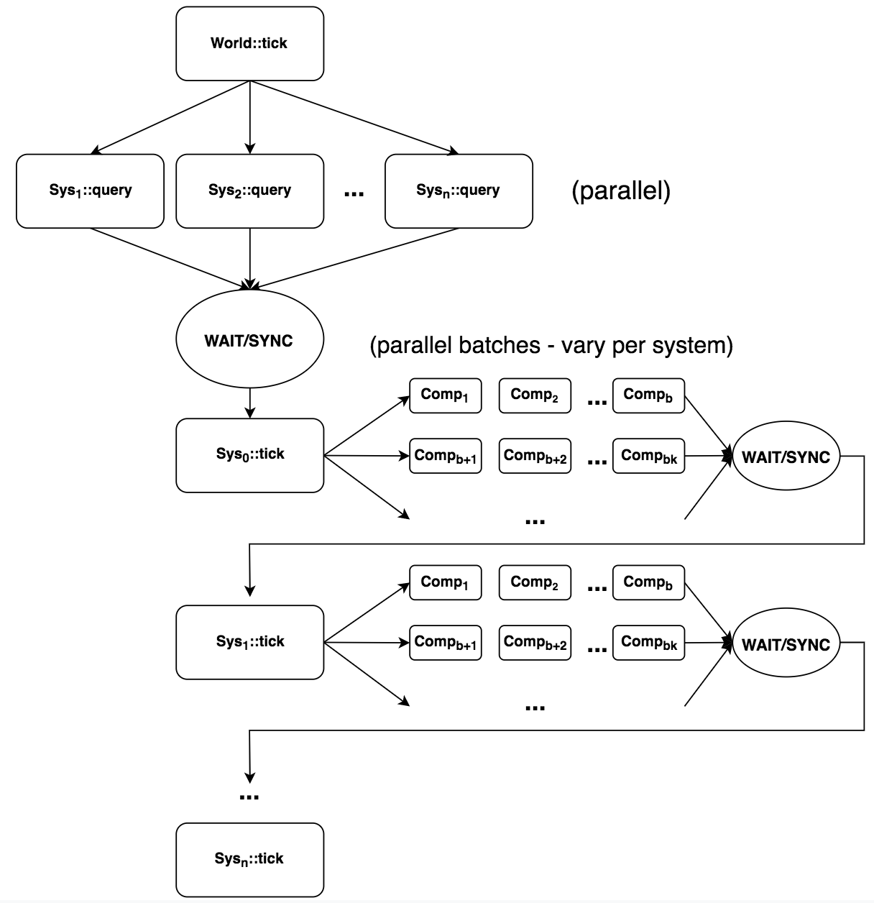

Tiny Engine
===========

This is a work-in-progress implementation of a minimal ECS (Entity Component System) game engine, using modern C++17 OpenGL 4.1
The engine is currently 2D but can easily be extended to 3D. Future plans also include replacing the GL renderer with Vulkan and/or Metal.

`LinkedIn <https://www.linkedin.com/in/federicosaldarini>`_ |
`0xfede.io <https://0xfede.io>`_ | `GitHub <https://github.com/saldavonschwartz>`_
